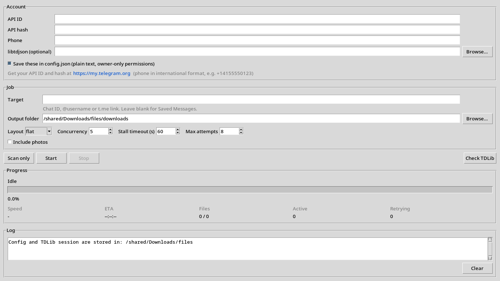

# Televex

A fast, resumable Telegram bulk file downloader built with Python and TDLib.

Download files from chats, channels, groups, or Saved Messages through a simple desktop GUI or the command line.



## Features

- 🖥️ **GUI and CLI** — use whichever fits your workflow
- ⚡ **Concurrent downloads** — download multiple files at once
- ▶️ **Resume support** — continue interrupted downloads
- 🔁 **Automatic retries** — recover from stalled downloads
- ⏭️ **Skip completed files** — never redownload finished files
- 📂 **Flexible organization** — flat, by file type, or by month
- 📊 **Live progress** — speed, progress, and ETA
- 🔍 **Scan-only mode** — see what will be downloaded before starting
- 🔐 **TDLib authentication** — uses your own Telegram account
- 🐧 **Linux, Windows, and macOS** support

## How it works

Televex uses [TDLib](https://github.com/tdlib/td) through
[python-telegram](https://github.com/alexander-akhmetov/python-telegram).

You authenticate with your Telegram account, choose a target, and Televault scans its message history for downloadable files.

Downloads are stored temporarily by TDLib and moved to their final location only after they are complete. This allows interrupted downloads to resume safely.

## Installation

You need **Python 3.9 or newer**.

```bash
git clone https://github.com/3m44n/televex.git
cd televex

python -m venv .venv
source .venv/bin/activate
pip install -r requirements.txt
